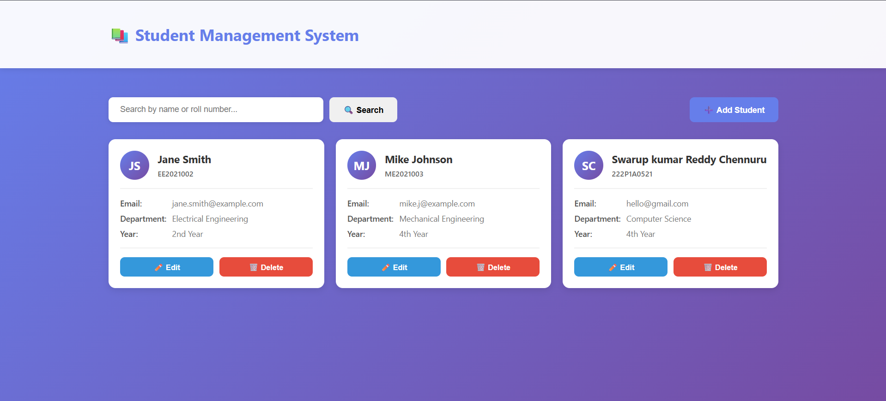
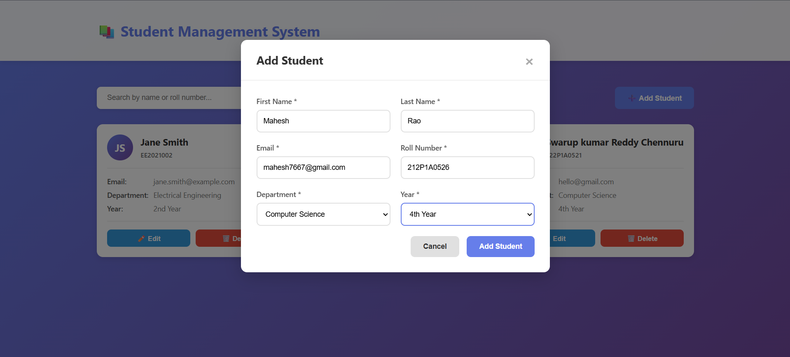
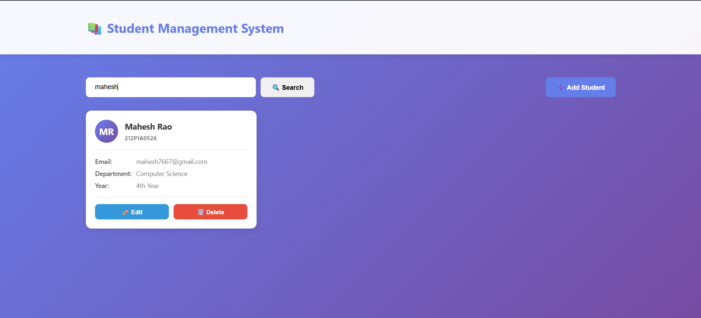

# 📚 Student Management System

A full-stack web application for managing student records built with **Spring Boot**, **MySQL**, and **HTML/CSS/JavaScript**.





## 🚀 Features

- ✅ **CRUD Operations** - Create, Read, Update, and Delete student records
- 🔍 **Search Functionality** - Real-time search by name or roll number
- 📱 **Responsive Design** - Mobile-friendly user interface
- 🎨 **Modern UI** - Clean and intuitive card-based layout
- ⚡ **RESTful API** - Well-structured backend with proper HTTP methods
- 🔐 **Data Validation** - Input validation and unique constraints
- 🕒 **Auto Timestamps** - Automatic creation and update timestamps

## 🛠️ Technologies Used

### Backend
- **Java 17**
- **Spring Boot 3.2.0**
- **Spring Data JPA**
- **Spring Web**
- **MySQL 8.0**
- **Lombok**
- **Maven**

### Frontend
- **HTML5**
- **CSS3**
- **Vanilla JavaScript**
- **Fetch API**

## 📋 Prerequisites

Before running this project, make sure you have the following installed:

- [Java JDK 17+](https://www.oracle.com/java/technologies/downloads/)
- [MySQL 8.0+](https://dev.mysql.com/downloads/mysql/)
- [Maven](https://maven.apache.org/download.cgi) (or use Maven wrapper included)
- [Git](https://git-scm.com/downloads)
- Any IDE (IntelliJ IDEA, Eclipse, VS Code)

## ⚙️ Installation & Setup

### 1. Clone the Repository

```bash
git clone https://github.com/yourusername/student-management-system.git
cd student-management-system
```

### 2. Setup MySQL Database

Open MySQL Workbench or MySQL Command Line and run:

```sql
CREATE DATABASE sms_db;
USE sms_db;
```

The application will automatically create the required tables on first run.

### 3. Configure Database Connection

Open `src/main/resources/application.properties` and update your MySQL credentials:

```properties
spring.datasource.url=jdbc:mysql://localhost:3306/sms_db?useSSL=false&serverTimezone=UTC
spring.datasource.username=root
spring.datasource.password=YOUR_MYSQL_PASSWORD
```

**Important:** Replace `YOUR_MYSQL_PASSWORD` with your actual MySQL password.

### 4. Build and Run the Backend

**Using Maven Wrapper (Recommended):**

```bash
# Windows
mvnw.cmd spring-boot:run

# Linux/Mac
./mvnw spring-boot:run
```

**Using Maven (if installed globally):**

```bash
mvn spring-boot:run
```

**Using IDE:**
- Right-click on `StudentManagementSystemApplication.java`
- Select "Run" or "Debug"

The backend will start on `http://localhost:8080`

### 5. Run the Frontend

1. Navigate to the `frontend` folder
2. Open `index.html` in your web browser
3. Or use Live Server extension in VS Code for better development experience

## 📁 Project Structure

```
student-management-system/
├── src/
│   └── main/
│       ├── java/
│       │   └── com/example/studentmanagementsystem/
│       │       ├── controller/
│       │       │   └── StudentController.java
│       │       ├── model/
│       │       │   └── Student.java
│       │       ├── repository/
│       │       │   └── StudentRepository.java
│       │       ├── service/
│       │       │   └── StudentService.java
│       │       └── StudentManagementSystemApplication.java
│       └── resources/
│           └── application.properties
├── frontend/
│   └── index.html
├── pom.xml
└── README.md
```

## 🔌 API Endpoints

| Method | Endpoint | Description |
|--------|----------|-------------|
| GET | `/api/students` | Get all students |
| GET | `/api/students/{id}` | Get student by ID |
| GET | `/api/students/search?q={query}` | Search students by name/roll number |
| POST | `/api/students` | Create new student |
| PUT | `/api/students/{id}` | Update student |
| DELETE | `/api/students/{id}` | Delete student |

### Sample Request Body (POST/PUT)

```json
{
  "firstName": "John",
  "lastName": "Doe",
  "email": "john.doe@example.com",
  "rollNumber": "CS2024001",
  "department": "Computer Science",
  "year": 2
}
```

## 🎯 Usage

### Adding a Student
1. Click the **"➕ Add Student"** button
2. Fill in all required fields
3. Click **"Save"**

### Editing a Student
1. Click the **"✏️ Edit"** button on any student card
2. Modify the desired fields
3. Click **"Save"**

### Deleting a Student
1. Click the **"🗑️ Delete"** button on any student card
2. Confirm the deletion in the popup dialog

### Searching Students
- Type in the search box at the top
- Results will filter in real-time as you type
- Search works for first name, last name, and roll number

## 🧪 Testing the API

You can test the API using tools like:

### Using cURL

```bash
# Get all students
curl http://localhost:8080/api/students

# Add a new student
curl -X POST http://localhost:8080/api/students \
  -H "Content-Type: application/json" \
  -d '{
    "firstName": "Jane",
    "lastName": "Smith",
    "email": "jane.smith@example.com",
    "rollNumber": "CS2024002",
    "department": "Computer Science",
    "year": 3
  }'
```

### Using Postman

1. Import the endpoints into Postman
2. Set the base URL to `http://localhost:8080/api/students`
3. Test all CRUD operations

## 🐛 Troubleshooting

### Port 8080 Already in Use
```properties
# Change port in application.properties
server.port=8081
```
Then update API_URL in `frontend/index.html` accordingly.

### Database Connection Failed
- Ensure MySQL service is running
- Verify database credentials in `application.properties`
- Check if database `sms_db` exists

### CORS Issues
- Verify `@CrossOrigin(origins = "*")` is present in `StudentController.java`
- Clear browser cache and reload

## 🔒 Security Note

⚠️ **Important:** This is a development setup with CORS enabled for all origins (`*`). 

For production deployment:
1. Replace `@CrossOrigin(origins = "*")` with specific allowed origins
2. Add Spring Security for authentication
3. Use environment variables for database credentials
4. Enable HTTPS

## 📝 Future Enhancements

- [ ] User authentication and authorization
- [ ] Pagination for large datasets
- [ ] Export data to Excel/PDF
- [ ] Student profile picture upload
- [ ] Email notifications
- [ ] Advanced filtering (by department, year)
- [ ] Sorting functionality
- [ ] Bulk import/export
- [ ] Dashboard with statistics
- [ ] Role-based access control

## 🤝 Contributing

Contributions are welcome! Please feel free to submit a Pull Request.

1. Fork the repository
2. Create your feature branch (`git checkout -b feature/AmazingFeature`)
3. Commit your changes (`git commit -m 'Add some AmazingFeature'`)
4. Push to the branch (`git push origin feature/AmazingFeature`)
5. Open a Pull Request

## 👤 Author

**Your Name**
- GitHub: [@chennuruswarup](https://github.com/chennuruswarup8125)
- LinkedIn: [chennuruswarup](https://www.linkedin.com/in/chennuruswarup)
- Email: swarup8125@gmail.com

## 🙏 Acknowledgments

- Spring Boot Documentation
- MySQL Documentation
- Stack Overflow Community
- All contributors who help improve this project

---

⭐ **If you find this project helpful, please give it a star!** ⭐

Made with ❤️ using Spring Boot and MySQL
